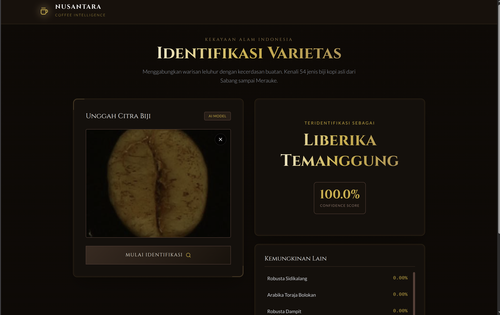

# Web Coffe Beans Classification

Web Coffe Beans Classification adalah aplikasi web modern yang dirancang untuk mengidentifikasi varietas biji kopi Indonesia menggunakan teknologi _Fine-Grained Visual Classification_. Aplikasi ini memungkinkan pengguna untuk mengunggah citra biji kopi dan mendapatkan prediksi varietas beserta tingkat keyakinannya (_confidence score_) secara _real-time_.

 _<!-- Ganti dengan screenshot aplikasi jika ada -->_

## 🌟 Fitur Utama

- **Identifikasi Otomatis**: Menggunakan model _Machine Learning_ (via API) untuk mengenali 54 jenis biji kopi dari berbagai daerah di Indonesia (Aceh Gayo, Toraja Sapan, Bali Kintamani, dll).
- **Antarmuka Modern & Responsif**: Dibangun dengan desain premium bertema "Nusantara" (Warna Kopi & Emas) yang responsif di berbagai perangkat.
- **Real-time Prediction**: Menampilkan hasil prediksi utama dan kemungkinan alternatif lainnya secara instan.
- **Drag & Drop Upload**: Kemudahan unggah gambar dengan fitur _drag and drop_.

## 🛠️ Teknologi yang Digunakan

- **Framework**: [Next.js 16](https://nextjs.org/) (App Router)
- **Bahasa**: [TypeScript](https://www.typescriptlang.org/)
- **Styling**: [Tailwind CSS v4](https://tailwindcss.com/)
- **Icons**: [Lucide React](https://lucide.dev/)
- **State Management**: React Hooks (`useState`, `useCallback`)
- **API Integration**: Custom Hook (`useImagePrediction`)

## 🚀 Cara Menjalankan Project

Ikuti langkah-langkah berikut untuk menjalankan proyek ini di komputer lokal Anda.

### Prasyarat

Pastikan Anda telah menginstal:

- [Node.js](https://nodejs.org/) (versi 18 atau lebih baru)
- Package manager (`npm`, `yarn`, `pnpm`, atau `bun`)

### Instalasi

1.  **Clone repositori ini:**

    ```bash
    git clone https://github.com/Fth87/web-biji-hitam-Fine-Grained-Visual-Classification-.git
    cd web-biji-hitam-Fine-Grained-Visual-Classification-
    ```

2.  **Instal dependensi:**

    ```bash
    npm install
    # atau
    pnpm install
    ```

3.  **Siapkan Backend API:**
    Clone dan jalankan backend server dari repositori berikut:
    [Backend Biji Hitam](https://github.com/Fth87/backend-biji-hitam-Fine-Grained-Visual-Classification)

    Pastikan backend berjalan (biasanya di `http://127.0.0.1:8000`).

4.  **Konfigurasi Environment Variable:**
    Buat file `.env.local` di root direktori proyek ini dan sesuaikan `NEXT_PUBLIC_API_URL` dengan alamat backend Anda:

    ```env
    NEXT_PUBLIC_API_URL=http://127.0.0.1:8000
    ```

5.  **Jalankan server pengembangan:**

    ```bash
    npm run dev
    # atau
    pnpm dev
    ```

6.  **Buka aplikasi:**
    Buka [http://localhost:3000](http://localhost:3000) di browser Anda.

## 📂 Struktur Proyek

```
web-biji-hitam/
├── app/
│   ├── globals.css      # Global styles & Tailwind configuration
│   ├── layout.tsx       # Root layout
│   ├── page.tsx         # Halaman utama (Upload & Result UI)
│   └── layouts/         # Komponen UI (Navbar, Footer)
├── hooks/
│   └── useImagePrediction.ts # Custom hook untuk integrasi API
├── public/              # Aset statis
├── .env.local           # Environment variables (tidak dicommit)
├── package.json         # Dependensi proyek
└── README.md            # Dokumentasi ini
```

## 📝 Lisensi

Proyek ini dibuat untuk keperluan tugas akhir mata kuliah Pembelajaran Mesin dan Penambangan Data.

---

Dibuat dengan ☕ dan ❤️ oleh [Fatih](https://github.com/Fth87) dan tim.
